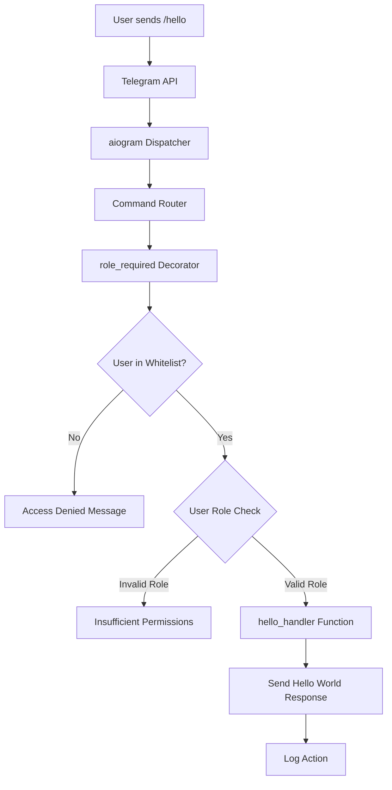
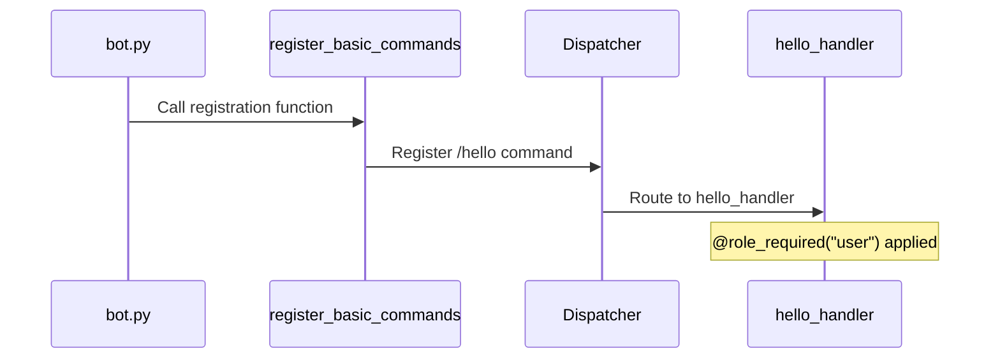

# Hello World Command Feature Design

## Overview

This design document outlines the implementation of a new `/hello` command for the tg_stream_bot Telegram bot. The command will provide a simple "Hello World" greeting functionality that follows the existing bot architecture patterns and integrates seamlessly with the current role-based access control system.

**Feature Value**: This command serves as a basic greeting mechanism and can be used as a template for future command implementations, demonstrating proper integration with the bot's authentication and command registration systems.

## Architecture

### Repository Type
**Backend Application** - Telegram Bot Service using aiogram framework

### Technology Stack Integration
- **Framework**: aiogram 3.7.0 (async Telegram bot framework)
- **Language**: Python 3.12.10
- **Authentication**: Role-based access control with whitelist
- **Logging**: loguru for structured logging
- **Deployment**: Docker containerization support

### Component Architecture



### Integration Points

| Component | Integration Method | Purpose |
|-----------|-------------------|---------|
| `commands/basic.py` | Add new handler function | Command implementation |
| `decorators/auth.py` | Use existing `@role_required` | Access control |
| `bot.py` | Existing registration system | Command registration |
| Logging system | Existing loguru setup | Action tracking |

## Command Specification

### Command Definition
- **Command**: `/hello`
- **Access Level**: `user` (lowest permission level)
- **Response Type**: Text message
- **Async Support**: Yes (follows existing pattern)

### Handler Function Signature
```python
@role_required("user")
async def hello_handler(message: types.Message) -> None
```

### Response Behavior

| Scenario | Response | Language |
|----------|----------|----------|
| Authorized User | "Hello World! 👋" | English |
| Unauthorized User | "❌ У вас нет доступа к этому боту." | Russian (existing pattern) |
| Insufficient Role | "❌ Недостаточно прав. Требуется роль: user" | Russian (existing pattern) |

### Command Registration Flow



## Implementation Strategy

### File Modifications Required

1. **commands/basic.py**
   - Add `hello_handler` function
   - Update `register_basic_commands` to include new handler
   - Follow existing code style and patterns

2. **No changes required for**:
   - `bot.py` (uses existing registration system)
   - `decorators/auth.py` (reuses existing decorator)
   - `config.py` (no new configuration needed)

### Code Integration Pattern

The new command follows the established pattern:
1. **Handler Function**: Async function with `@role_required` decorator
2. **Registration**: Added to `register_basic_commands` function
3. **Response**: Simple text message using `message.answer()`
4. **Error Handling**: Handled by decorator (access control)

### Testing Considerations

**Unit Testing** (following existing test structure):
- Test authorized user receives correct response
- Test unauthorized user receives access denied
- Test command registration in dispatcher
- Test role requirement enforcement

**Integration Testing**:
- Test end-to-end command execution
- Test with different user roles
- Test command appears in bot command list

### Security & Compliance

| Security Aspect | Implementation |
|-----------------|----------------|
| Access Control | `@role_required("user")` decorator |
| User Validation | Whitelist check in decorator |
| Role Verification | ROLE_HIERARCHY validation |
| Logging | Automatic via existing loguru setup |

## Deployment Considerations

### Backward Compatibility
- ✅ No breaking changes to existing commands
- ✅ Uses existing authentication system
- ✅ Follows established patterns
- ✅ No database schema changes required

### Performance Impact
- **Minimal**: Single additional command handler
- **Memory**: Negligible increase
- **Response Time**: Same as existing basic commands

### Rollout Strategy
1. **Development**: Implement in commands/basic.py
2. **Testing**: Run existing test suite + new tests
3. **Deployment**: Standard Docker build and deploy
4. **Verification**: Test `/hello` command functionality

## Error Handling

### Error Scenarios

```mermaid
graph TD
    A[/hello command] --> B{User authorized?}
    B -->|No| C[Return access denied]
    B -->|Yes| D{Message object valid?}
    D -->|No| E[Log error, fail gracefully]
    D -->|Yes| F[Send hello response]
    F --> G{Response sent successfully?}
    G -->|No| H[Log error]
    G -->|Yes| I[Success]
```

### Logging Events
- Command execution attempts
- Access control violations
- Successful command responses
- Any runtime errors during execution